# Banco para millennials

Enfocados en los millennials proponemos una aplicación móvil enfocada en la omnicanalidad. Que nuestros usuarios tengan total libertad al realizar sus operaciones de manera rápida y sencilla con la misma seguridad que tienen al acercarse a una ventanilla.

## Desarollado para
[Laboratoria](http://www.laboratoria.la/)

El banco del país actualmente se encuentra por un proceso de transformación digital. Como parte de este proceso, han implementado el área de innovación para liderar la migración de las principales transacciones financieras, a una plataforma digital.

## Idea de Negocio

Enfocados en los millennials proponemos una aplicación móvil enfocada en la omnicanalidad. Que nuestros usuarios tengan total libertad al realizar sus operaciones de manera rápida y sencilla con la misma seguridad que tienen al acercarse a una  ventanilla.

## Research

### Banco digital para millenials
 
   La transformación digital ha dejado de ser una opción para pasar a ser una necesidad real. Es por ese motivo que el Banco del País se han propuesto crear un banco 100% digital dirigido para millenials.
 
   Los millennials también conocida como generación Y, son las personas nacidas entre los años 1980 y 2000. Son los que conocieron de      primera mano todo lo concerniente a la evolución tecnológica de fines del siglo XX.
 
   “Todos los millennials son diferentes de acuerdo con su país de origen”, pero la globalización ha hecho que sean más similares entre    sí, en comparación a las generaciones pasadas.
 
### Características de los Millennials
 
* La tecnología, es una herramienta natural para estos jóvenes en su día a día, el internet, el dispositivo móvil, los medios sociales son su forma de vida.

* Son personas que se adaptan fácil y rápidamente a los cambios.

* Tienen al Internet como herramienta primordial para diversas actividades cotidianas como comprar, socializar o ver televisión.

* Se declaran independientes y forman el grupo con mayor descontento político y religioso.
 
### Las instituciones financieras y los millennials
 
Estas buscan nuevas estrategias e invierten en grande para fidelizar a esta generación de clientes, desinformados respecto de temas financieros y familiarizados con la tecnología.
 
El 40% de los millennials nunca ha pisado una sucursal bancaria y que la mayoría no está familiarizado con las funciones que cumplen las instituciones financieras, pues muchos ven ajenos conceptos como tasas, intereses y créditos. Incluso, el mismo estudio destaca que el 53% no piensa que su banco sea diferente al de los demás, por lo que uno de cada tres estaría dispuesto a cambiar de entidad fácilmente.
 
Es por eso por lo que la principal vía de comunicación entre estas instituciones y sus clientes son las páginas web y las aplicaciones que han desarrollado los bancos para smartphones, donde una buena o mala aplicación móvil puede sellar la imagen de la empresa frente a sus clientes más jóvenes. 
 
## Objetivo del Banco del País
 
* Los Millennials puedan acceder a cualquier servicio del banco a través del Internet desde el computador o cualquier aparato móvil.
Banco 100% digital.

* Establecer alianzas en la red más grande de supermercados.

* Uso ilimitado de agentes y ATM’s.
 
## STAKEHOLDERS

Stakeholders interno: stakeholder que forma parte directa de la organización.
 
* CEO
* Gerente de marketing
* Gerente de IT
* Gerente de agencias
* Jefe de innovación
* Comunity manager
* Regulador estatal
* Front-end
 
Stakeholders externo: stakeholder que no forman parte directa de la organización.
 
* Millennials
 
## REUNIÓN KICK OFF
 
El objetivo de esta primera reunión es conocer a los principales stakeholders y saber quiénes son los que tomarán las decisiones en el transcurso del proyecto. Es importante alinear los esfuerzos y trabajar de manera conjunta así como planificar la medición y el progreso de cada área.

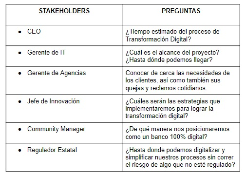

## BUSINESS MODEL CANVAS

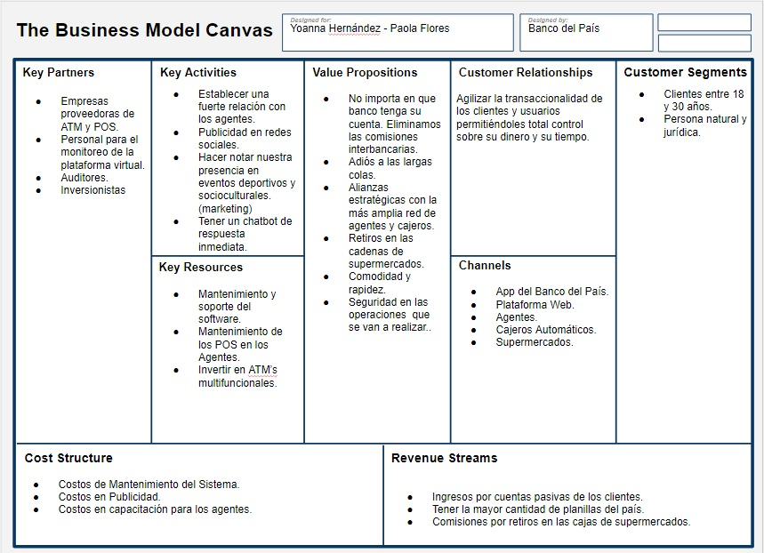

## Organización de la investigación en Trello

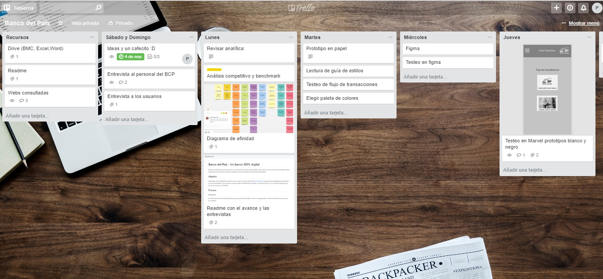

Para mayor información de la organización revisar Trello: https://trello.com/b/aEIfjlCk/banco-del-pa%C3%ADs

## RECOPILACIÓN Y ANÁLISIS DE DATOS

### Encuestas on-line

**Conclusiones**

* La gran problemática venía  por las colas que tienen que hacer al estar en una agencia bancaria y casi el 50% de encuestados le        molesta el tiempo de espera.

* Se identifico las principales transacciones que los millennials hacían en la web y/o app del banco: _Transferencias, retiros y pago de   servicios_.

* Casi el 60% de personas encuestadas usan una aplicación móvil o una página web.

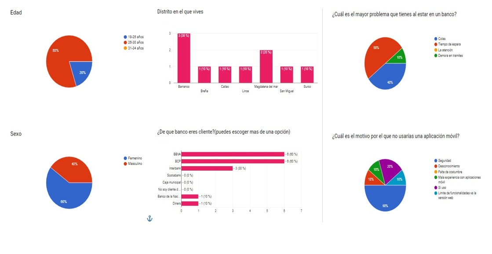

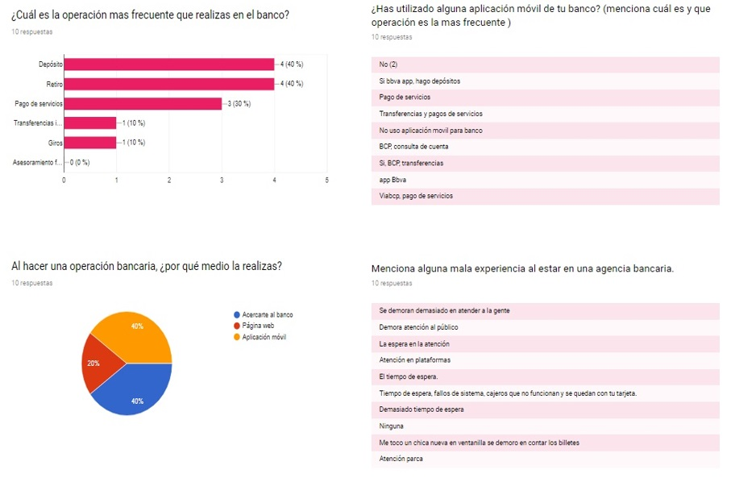

### Entrevistas a expertos

Entrevista realizada  a 3 personas que laboran en  diferentes bancos del Perú.

**Conclusiones**

* Falta de rapidez al momento de atender a los clientes en el banco, lo que genera mayores colas.

* Se debe de enseñar al cliente que pueden usar el aplicativo móvil del banco para pago de servicios, pagó de impuesto y otros trámites.

* Hay operaciones bancarias que pueden  ser debitadas  automáticamente desde una tarjeta con el uso de una aplicación web.

* Una aplicación móvil debe ser fácil de usar e intuitiva.

**BCP**

* ¿Cuáles son las quejas más recurrentes en la agencia?

   - cobros indebidos
   - errores en operaciones, extornos por pagos dobles

* ¿Que transacciones crees que podrían migrarse a una aplicación móvil y dejar de atenderse en ventanilla?

   - Pagos de servicios (impuestos, y servicios varios) 
   - Operaciones de tipo de cambio.

* En qué crees que podrían mejorar los servicios o la atención que  brinda el banco? 

    - Podría mejorar en procesos: Simplificando procesos 
    - Mejorar los tiempos de respuesta de diversos trámites

* La aplicación móvil que tiene el banco es óptima, explicanos (si/no)¿porqué?

    - La aplicación del banco si es óptima, ya que todos los pagos son en línea y rápidos salvo algunos pagos que tienen restricción de     hora, estos son fijados por la empresa recaudadora.

* La edad promedio que usa la aplicación móvil:

    - No estoy seguro, pero  por lo general lo usan personas de nuestra edad, aunque se podría  instruir a personas de más edad  usen Yape 

**BANCO DE LA NACION**

* ¿Cuáles son las quejas más recurrentes en la agencia?

  - Quejas hay muchas, pero las que saltan a simple vista así no seas cliente asiduo  al banco, son  las colas es con algo que se sigue peleando  día a día, hemos agilizado los trámites en ventanilla  pero aún así no  disminuimos el tiempo de espera.

* ¿Que transacciones crees que podrían migrarse a una aplicación móvil y dejar de atenderse en ventanilla?

  - Los pagos de tributos y detracciones, a mi parecer eso  lo podrían debitar automáticamente de sus tarjetas no es necesario hacer una cola de casi una hora para hacer ese pago 

* En qué crees que podrían mejorar los servicios o la atención que  brinda el banco? 

  - A veces es estresante el trabajo en ventanilla, y atender a tantas personas en 5 horas  es abrumante mejoraría mantener  motivando al trabajador y clases de coaching para q brinde una mejor atención

* La aplicación móvil que tiene el banco es óptima, explicanos (si/no)¿porqué?

   - Si es óptima pero debe de enseñar a los cliente a utilizarlos porque no es intuitiva

* La edad promedio que usa la aplicación móvil 

   - Mas son jóvenes porque ellos quieren todo rápido y simplificado, son los más renegones al tener que esperar  en una cola de banco.

**SCOTIABANK**

* ¿Cuáles son las quejas más recurrentes en la agencia?

   - Falta de rapidez (pese a que están operativos las recontadoras de billetes y monedas),

   - Falta de ventanillas (se tiene 5 módulos y sólo atienden 3 por el staff establecido)

   - Falta de personal en horarios de refrigerio / alta afluencia (lastimosamente los horarios de refrigerio coinciden con las de las instituciones cuyos trabajadores vienen a cobrar al banco o a sacar / reponer sus tarjetas)

   - Falta de Agentes cercanos a la Agencia (para derivar y desahogar las colas)

   - Falta de conocimiento por parte del personal de los productos y servicios, así como de los canales electrónicos (internet, ATMs, etc)

   - Falta de amabilidad, cortesía, (Bienvenida, Sonrisa, Dilculpa, lentitud del sistema)

   - Falta de bancas de atención con módulo de servimatic (TV, ticket de espera)

   - Falta de priorización de colas (segmentación de clientes A,B, C, BEx, Premiun, etc)

   - Falta de una persona que atienda en el hall y derive las operaciones a los canales electrónicos, internet, ATMs, etc

* ¿Que transacciones crees que podrían migrarse a una aplicación móvil y dejar de atenderse en ventanilla?

   Considerar los parámetros que establece la SBS para lavado de activos

   - Depósitos a ATMs en soles y dólares

   - Solicitud / Reclamos de estados de cuenta vigentes e históricos a través de las plataformas virtuales,

   - Emisión de chequeras se realizan en ventanilla

   - Solicitud / autorización de ampliación de montos de las transacciones en internet deben de realizarse personalmente,

   - Actualización de datos

* En qué crees que podrían mejorar los servicios o la atención que  brinda el banco? 

    - En cada Agencia, tener un back up tanto de PC como de recontadoras, para que cuando se malogre alguna no se vea afectada la atención

    - Establecer un plan de contingencia de atención en caso se caiga la línea / sistemas (lo tiene el BCP) y no se afecte la atención al público,

* La aplicación móvil que tiene el banco es óptima, explicanos (si/no)¿porqué?

    - Si, por la rapidez y no pide clave token para transacciones recurrentes y propias, pero el consumo de la memoria de la app es demasiada.

* La edad promedio que usa la aplicación móvil

    - Los personas jovenes menores de 35 años, que son los que paran pegados al celular.

## Benchmarks

**[Simple](https://www.simple.com/)**

En su Banca Móvil prioriza la comodidad a sus clientes. Entre las transacciones que ofrece son:
* Tarjeta de débito Visa
* Depósito de cheques
* Enlace de cuenta externa
* Transferencias instantáneas
* Servicios de pago de terceros
* Bloqueo de tarjeta

**[SelfBank](https://www.selfbank.es/)**

El banco digital para los que entienden el mundo de manera digital.
Centrados en hacer un banco digital y en conocer a fondo a sus usuarios SelfBank ofrece una plataforma que erradica la burocracia y el papeleo, entre sus principales atractivos tiene:

* Planes de pensión
* Invertir en fondos de inversión
* Abrir cuentas

## Síntesis y definición

**Afinnity Map**

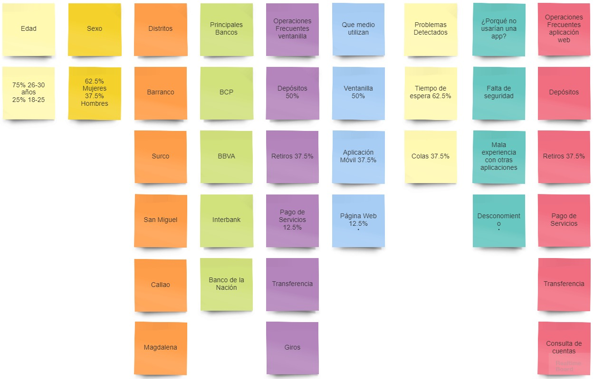

### User persona

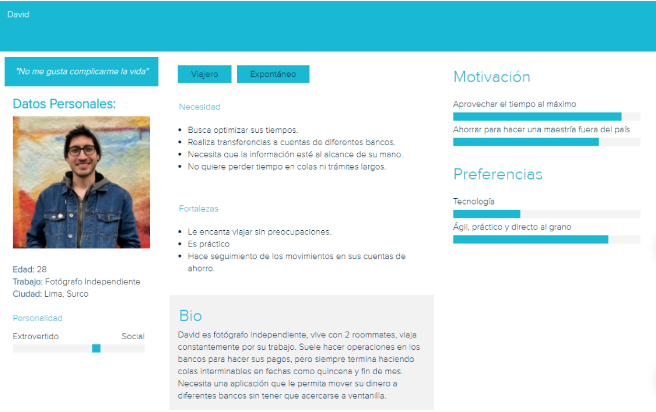

## Problem Statements

* **David necesita**  poder pagar los recibos de los diferentes servicios que tiene de manera rápida para no perder tiempo haciendo largas colas.

* **David necesita** hacer transferencia  de su cuenta bancaria a otras sin tener que pagar altas comisiones.

* **David necesita** poder pagar sus servicios públicos  con las diferentes tarjetas bancarias que tiene.

* **David necesita** disponer de  una aplicación móvil que tenga la  opción de tener diferentes tarjetas bancarias  para realizar todo tipo de pagos.

* **David necesita** revisar sus operaciones bancarias por el celular, para mantenerse informado en tiempo real.

### Customer Journey Map - PROCESOS CRÍTICOS

* Transferencia
* Trámites largos
* Cobros excesivos
* Largas colas
* Tiempo de espera

## Ideación

### User flow
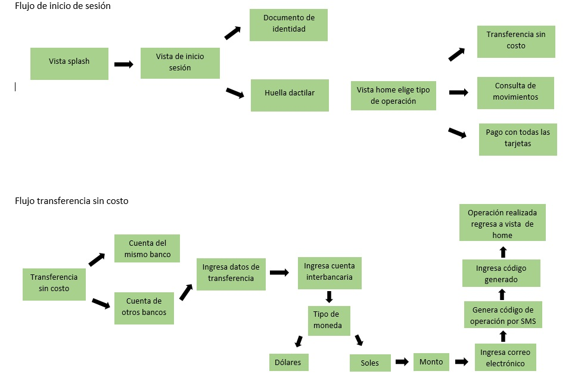

### Prototipo en papel

 * Primer flujo de transferencia bancaria 
 
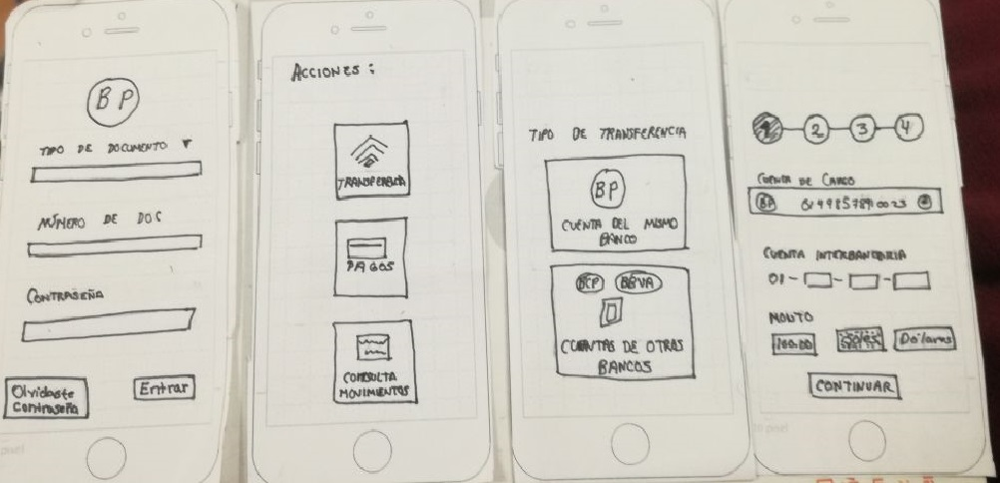
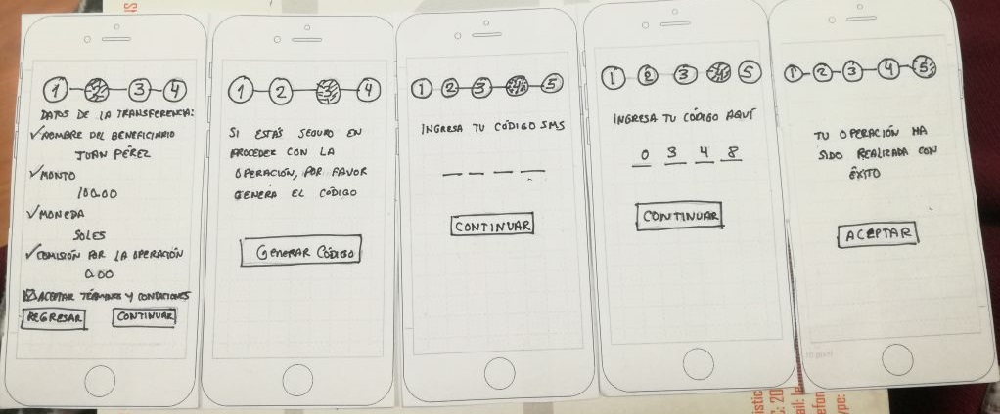

* Segundo flujo de pago de servicios-agua

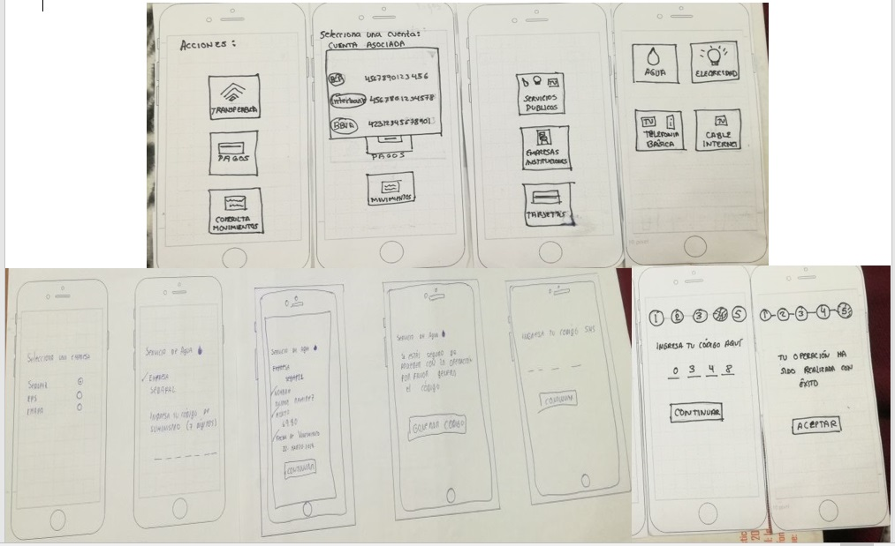

### Prototipo en Marvel a blanco y negro

Se hizo un prototipo en escala de grises para ver que colores eran los indicados, y que los usarios nos den su opinión

https://marvelapp.com/14a1i2j6

## Testing

* Prototipo en papel

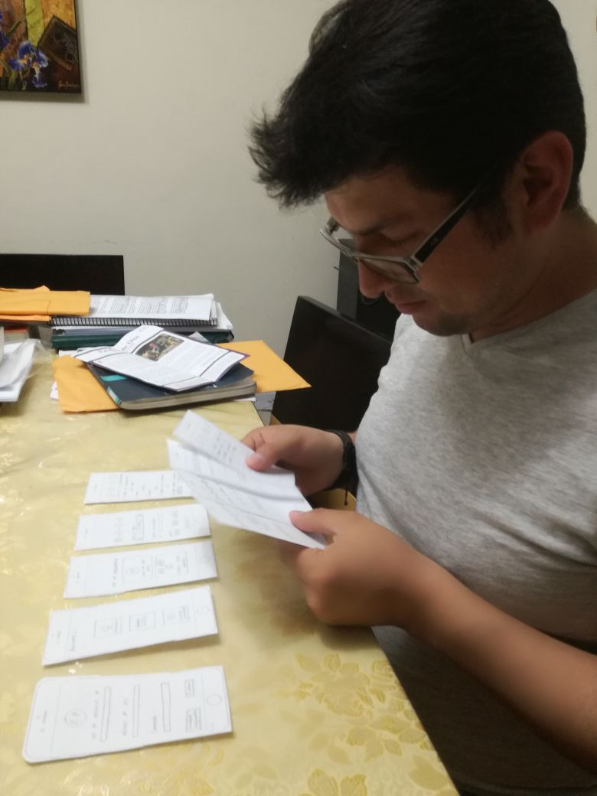

* Prototipo en escala de grises

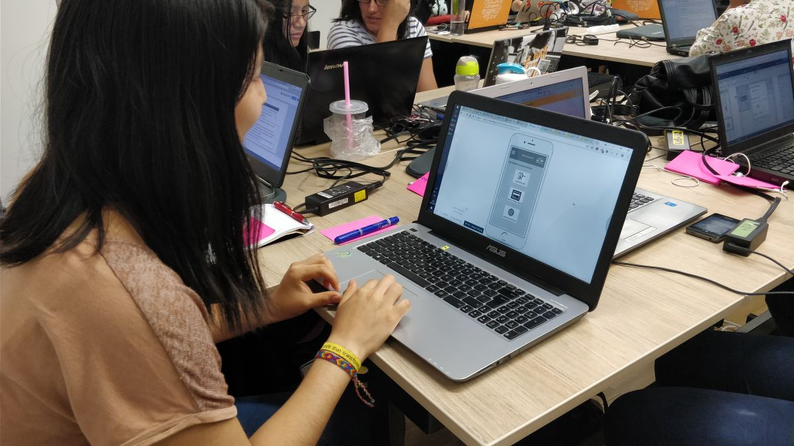

## Conclusiones

Se realizó el testeo con 5 usuarios millennials.

### Positivas

* Le agradan los colores que tienen la aplicación.
* Fácil de aprender a usarla.
* El uso de huella digital le gusto.

### Puntos por mejorar

* En la página de inicio hubiese querido encontrar alguna frase.
* No entendió bien porque tenia que poner su correo electrónico al hacer la transferencia interbancaria.
* Quiere que tenga mas operaciones para realizar.

## Equipo de trabajo

* Paola Flores 
* Yoanna Hernandez
